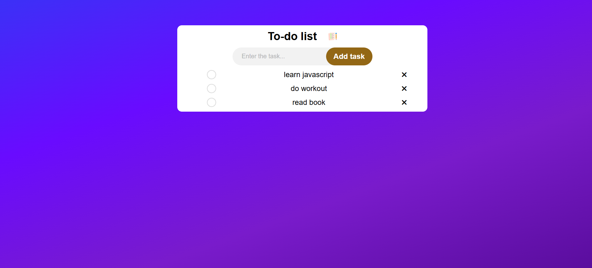

# To-Do List App

A simple, responsive to-do list application that lets users add tasks, mark them as complete, and remove them. The project uses HTML, CSS, and JavaScript along with localStorage to persist data, ensuring that tasks remain saved between browser sessions.

---



## Table of Contents

- [Features](#features)
- [Technologies Used](#technologies-used)
- [Installation and Setup](#installation-and-setup)
- [Usage](#usage)
- [Project Structure](#project-structure)
- [Future Improvements](#future-improvements)


---

## Features

- **Add Tasks:** Easily add new tasks via the input form.
- **Mark as Complete:** Click on a task to toggle a "completed" state (line-through style).
- **Remove Tasks:** Remove tasks by clicking the cross (x) icon.
- **Data Persistence:** Uses `localStorage` to save your tasks so they persist even after the browser is closed.
- **Responsive Design:** Adapts to various screen sizes with mobile-friendly styling.
- **Icon Integration:** Uses Font Awesome for clear and modern icons.

---

## Technologies Used

- **HTML5** – Provides the structure of the web application.
- **CSS3** – Custom styling for a clean, modern user interface, including responsive design.
- **JavaScript (ES6)** – Implements the task management logic and localStorage persistence.
- **Font Awesome** – Adds attractive icons for task removal.
- **LocalStorage API** – Stores task data locally in the browser.

---

## Installation and Setup

1. **Clone the Repository:**

   ```bash
   git clone https://github.com/yourusername/todo-list-app.git
   ```

2. **Navigate to the Project Directory:**

   ```bash
   cd todo-list-app
   ```

3.**Open the Project:**
Open the `index.html`file in your preferred web browser. No additional server setup is required.

## Usage
-**Adding a Task:**

-Type your task into the input field and click the "Add task" button.
The new task will appear in the list along with a clickable cross icon.

-**Completing a Task:**

-Click on any task in the list to toggle its completion status. A completed task will have a line-through style.
-**Removing a Task:**

-Click the cross (x) icon next to a task to remove it from the list.

-**Data Persistence:**

The app automatically saves your tasks to the browser’s localStorage. Refresh or reopen the page, and your tasks will still be available.

## Project Structure

```bash

/todo-list-app
├── index.html         # Main HTML file containing the structure of the app
├── style.css          # CSS file for styling the application
├── script.js          # JavaScript file containing the logic for task management
└── /images            # Folder containing images (icons for tasks, etc.)
```

## Future improvements ##

-Implement a dark mode feature.
-Add the ability to edit existing tasks.
-Introduce a drag-and-drop feature to reorder tasks.
-Sync tasks across multiple devices using a backend database.


